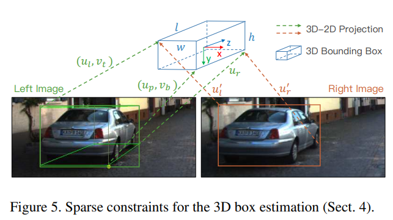
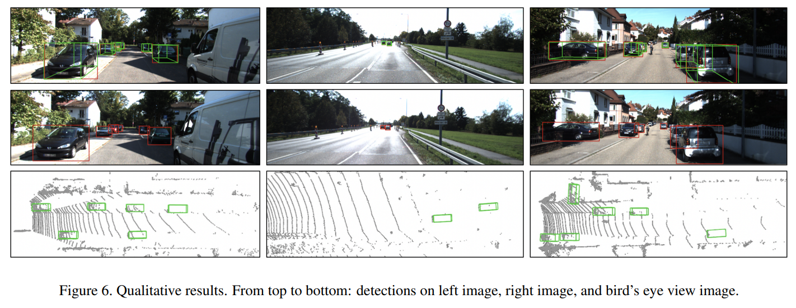

# Stereo R-CNN

| 제목 | Stereo R-CNN based 3D Object Detection for Autonomous Driving |
| ---- | :----------------------------------------------------------: |
| 저자 |        Peiliang Li , Xiaozhi Chen , and Shaojie Shen         |
| 출판 |                          IEEE 2019                           |

## Introduction

- 본 논문은 fast R-CNN을 기반으로 하여 stereo 이미지를 입력으로 사용하는 네트워크를 소개했다.

- Region Proposal Network(RPN) 뒤에 추가적인 branch를 붙여서 keypoint, view-point angle을 예측한다.

일반적인 3D object detection은 LiDAR를 주로 사용하지만, LiDAR를 사용하면 연산량이 많아지고 인식 가능한 거리가 짧다. 또한 LiDAR 스펙에 따라 듬성듬성한 데이터를 사용하기 때문에 한계가 있다고 본 논문의 저자는 주장한다. 따라서 본 논문은 stereo 이미지를 사용한 R-CNN계열의 network를 소개하며 전체적인 구조를 다음과 같이 세 단계로 나누었다.

1. stereo RPN 모듈: 

   left, right이미지의 RoI영역을 얻는다.

2. stereo regression & keypoint branch: 

   RoI Align이 끝나면 left, right feature를 concatenate하여 물체의 카테고리를 분류하고, 2D박스와 view-point angle, dimension을 regression한다.

   keypoint branch에서는 left RoI feature만을 가지고 예측한다.

   dimension은 3D GT의 w, h, l에 대해 regression한다.

3. 3D box estimation:

   left 2D박스와 keypoint를 사용하여 3D박스를 예측한다.

## Stereo R-CNN

### 네트워크 구조

stereo R-CNN의 네트워크 구성은 다음과 같다.

### stereo RPN

RPN은 sliding window 기반의 foreground detector이다. feature가 추출되고 나면 채널수 조절을 위해 3x3 conv-layer를 지나고, objectness와 box를 위한 두 개의 fc-layer를 지난다.

본 논문에서는 original RPN에 피라미드구조가 추가되어 Multi-scale feature를 얻어낼 수 있다. 각각의 scale별로 추출된 left, right feature를 concatenate하여 stereo RPN의 입력으로 사용하게 된다.

RPN에 사용되는 GT는 left, right이미지의 2D박스들중 maximum좌표를 사용하여 두 box를 모두 포함하는 union GT를 만들어 사용한다. 이 union GT박스와 scale별로 고정된 크기의 anchor박스들을 IoU연산하여 0.7이상이면 positive label, 0.3 이하면 negative label을 갖게한다. 이후 left, right의 GT박스와 positive label의 feature를 비교하여 regression을 진행한다.

regression에 사용되는 인자는 다음과 같다.

​																			$$[\Delta u, \Delta w, \Delta u', \Delta w', \Delta v, \Delta h]$$

- u, v: 이미지 공간에서 박스의 가로, 세로에 해당하는 중앙좌표(left 이미지)
- w, h: 박스의 가로, 세로크기(left 이미지)
- u', w': right 이미지의 해당값

여기서 특징은 v와 h는 left, right모두 같은 값을 사용한다는 점이다. 또한 left, right proposal들이 같은 anchor박스로부터 만들어졌고, objectness score를 공유하기 때문에 서로 일대일 대응 관계에 있다.

regression 이후 left, right에 각각 NMS를 적용하여 중복되는 값을 제거하고 2000개의 proposal을 사용하게 된다(test에서는 300개만 사용한다).

### Stereo R-CNN

stereo RPN단계의 출력인 left, right proposal 쌍에 RoI Align을 적용한다.

> RoI Align: pooling 단계에서 실수로 예측된 경우 정수로 근사시키지 않고 linear interpolation을 사용하여 모든 픽셀값들이 영향을 미칠 수 있도록 추출하는 것

이후 fc-layer와 ReLU-layer를 적용하여 feature map을 생성한 후 box, view-point, class, dimension을 예측한다.

- box: RoI와 GT박스의 IoU가 0.5 이상이면 그것은 foureground이고, 미만이면 background이다. foreground에 대해서만 left, right GT와 비교한다.

- view-point angle: 다음 그림과 같은 관계의 $\theta, \beta$를 이용하여 $\alpha = \theta+\beta$로 정의하고, 그에 대해 regression을 진행한다. 이때 불연속성을 피하기 위해 target은 $[sin \alpha, cos\alpha]$로 사용한다.

  

### keypoint prediciton

3D박스의 밑면의 꼭짓점을 sementic keypoint라고 이름짓고, 이들 중 2D박스의 밑변의 선상에 위치한 것을 perspective keypoint라고 한다. 또한 3D박스 밑면의 u중 min, max값을 boundary keypoint로 지정하여 추후에 일반적인 크기의 객체만 걸러낼 수 있도록 Mask역할로 사용한다.

keypoint를 예측할때는 Mask-RCNN과 같은 방법을 사용하되, 오직 left feature에 대해서만 진행한다.

- 먼저 14x14 feature map을 연속된 256-d 3x3 conv연산을 진행하고, ReLU layer를 적용한다.
- 2x2 upsampling을 통해 feature map의 크기를 28x28로 늘린다.
- 사실상 2D밑변과 3D밑면의 꼭짓점 좌표중 u값만 다르므로, 현재 6x28x28(feature, width, height)인 feature map에서 같은 값으로 채워진 height차원을 하나로 합쳐서 6x28의 크기로 만든다.
- 6개의 feature중 앞 4개는 각각의 sementic keypoints예측값의 u가 잘 예측됐을 확률이고, 나머지 2개는 각각 left, right boundary keypoint일 확률이다. 이때 우리는 2D박스 밑변의 중앙쯤에 위치한 하나의 keypoint(perspective keypoint)만을 찾아도 되기때문에 앞선 4개에 대한 softmax연산을 진행하고, 뒤의 2개는 스스로에 대한 1x28 softmax연산을 진행한다.
- GT와 cross-entropy가 최소가 되도록 학습한다.

### 3D box estimation

3D박스는 다음과 같은 인자들로 표현할 수 있다.

​																				$$\mathbb{x} = \{ x, y, z, \theta\}$$

3D box estimation에서는 2D박스와 perspective keypoint를 사용하여 reprojection error를 최소화하도록 학습한다. 사용하는 인자는 다음과 같다.

​																		$$\mathbb{z} = \{u_l, v_t, u_r, v_b, u_l', u_r', u_p\}$$

- l, t, r, b: 각각 left, top, right, bottom을 의미한다.
- p: perspective keypoint의 좌표를 뜻한다.
- z는 카메라 인트린직 K에 대해 normalize된 좌표이다.

위와 같은 상황에서, 다음과 같은 수식을 통해 각각의 좌표를 얻어낸다. 이때 w, h, l은 regression된 dimension이고 b는 stereo camera의 baseline 길이이다.

이 수식은 논문 *Stereo Vision-based Semantic 3D Object and Ego-motion Tracking for Autonomous Driving*의 아이디어를 참고했으며, 원문에서는 2D박스에서 3D박스를 예측할때 다음 식을 사용했다. 이 식에서 $\pi$는 p가 3D박스의 중앙점일때 $\pi(\mathbf{p})=[p_x / p_z, p_y/ p_z]$인 3D projection warp function이고, _u는 perspective keypoint의 좌표이다. d는 dimension prior라고 말하는데, 이는 3D박스의 x, y, z축방향의 크기를 말한다.

> *Stereo Vision-based Semantic 3D Object and Ego-motion Tracking for Autonomous Driving* -> [본문 링크](https://openaccess.thecvf.com/content_ECCV_2018/papers/Peiliang_LI_Stereo_Vision-based_Semantic_ECCV_2018_paper.pdf)

$C_1$~ $C_4$까지는 다음과 같은 행렬이다.

또한 view-point angle $\alpha$에 대해서 다음 식으로 예측한다.

​																			$$\alpha = \theta + arctan(-{x \over z})$$

### Dense 3D box Alignment

본 논문에서는 3D박스의 중앙좌표에 대한 disparity를 풀어낸다. 

우선 valid RoI를 정하는데, 이는 boundary keypoint들 사이의 feature들중 아랫부분 절반으로 지정한다. 그 이유는 차량의 아랫쪽 절반이 3D박스에 더 타이트하게 맞기 때문이다. 

left 이미지에서 valid RoI영역의 normalize된 좌표 $(u_i, v_i)$에 위치한 픽셀값에 대한 photometric error는 다음과 같이 연산할 수 있다.

​																$$\mathbf{e_i} = ||I_l(u_i, v_i) - I_r(u_i- {b \over z+\Delta z_i})||$$

- $\Delta z_i = z_i - z$로, 픽셀 i에서의 z와 3D박스 중앙의 z값의 차이이다.

이때 e를 모두 더하여 total matching cost로 정하고, 이것이 최소가 되도록 학습하면 object의 depth를 예측할 수 있다.

​																					$$\mathbf{E} = \sum^{N}_{i=0}\mathbf{e}_i$$

### Implementation Details

#### Network

- ResNet-101과 FPN을 backbone으로 사용하였다.

- multi-scale을 위해 총 5가지의 anchor = {32, 64, 128, 126, 512}를 사용했고, 가로세로 {0.5, 1, 2} 비율로 사용했다.

- original 이미지는 세로 길이를 600픽셀로 줄였고, 가로세로의 비율은 유지했다. 
- stereo RPN에서는 left, right feature를 concatenate 했기때문에 1024채널의 입력값을 가지고, R-CNN에서는 512채널을 입력으로 한다.
- 한 쌍의 stereo 이미지를 처리하는데 걸리는 시간은 0.28초정도 소모된다(Titan Xp GPU 기준)

#### 실험 결과

