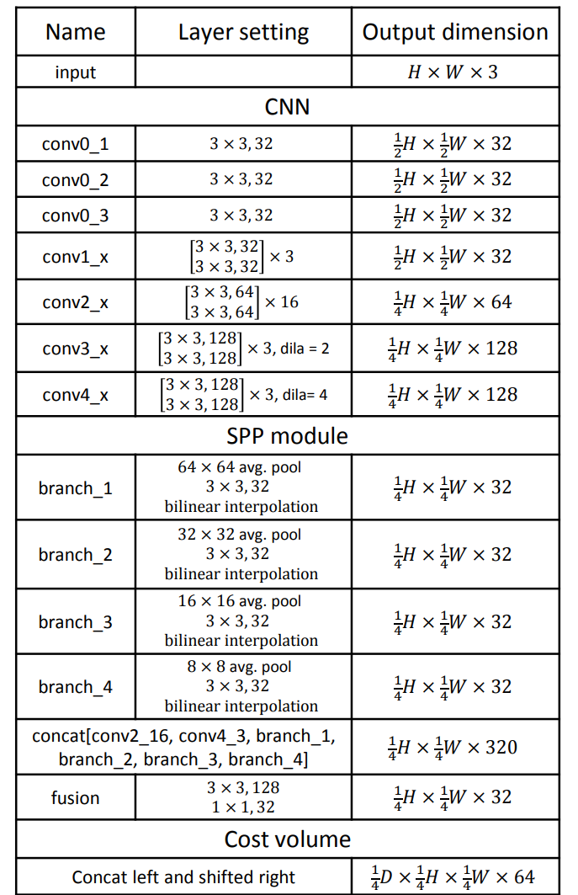
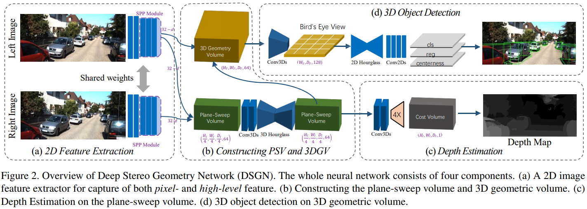
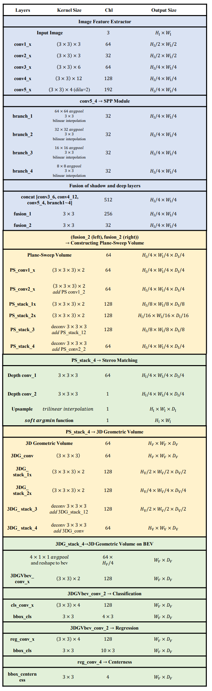
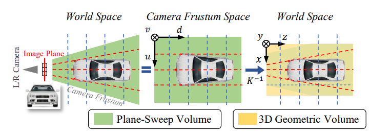
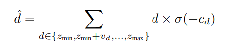
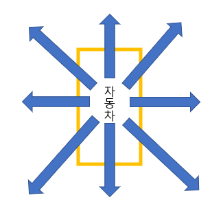
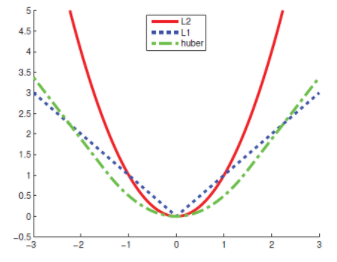
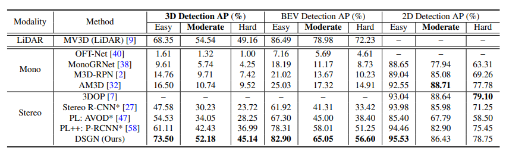
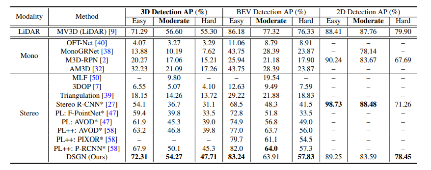

# Deep Stereo Geometry Network(DSGN)

| 제목 | DSGN: Deep Stereo Geometry Network for 3D Object Detection |
| ---- | :--------------------------------------------------------: |
| 저자 |             Yilun Chen, Shu Liu, Xiaoyong Shen             |
| 출판 |                         CVPR 2020                          |

> Yilun Chen : Chinese Univ. of Hong Kong,  Fast Point R-CNN is accepted by ICCV 2019의 저자, 2017 coco keypoint challenge 1위

## Introduction

본 논문은 stereo 이미지를 입력으로 사용하는 one-stage 3d object detection모델을 제안한다. 논문 저자의 주장에 따르면 본 논문은 기존 stereo이미지 방식의 모델들보다 AP가 10%정도 높다고 한다.

## Background

본 논문은 image feature extractor로 PSMNet(Pyramid Stereo Matching network)을 사용한다. 

> PSMNet 논문 : [Pyramid Stereo Matching Network](https://arxiv.org/pdf/1803.08669.pdf)
>
> Stereo Matching이란 stereo 이미지를 사용하여 disparity map을 얻는것을 목표로 하는 작업이다. 

PSMNet 논문에서 제안하는 CNN네트워크 구조는 다음과 같다.

이 네트워크를 통해 cost volume을 만들고, 이를 3D convolution연산에 적용하여 (height, width, disparity, feature size)에 대한 4차원 feature map(3D Geometry Volume)을 만든다.

## 네트워크 구조

본 논문의 네트워크 구조는 다음과 같다.

앞서 언급했듯이 PSMNet을 이용하여 left, right이미지의 feature map을 만들고, 이들을 concatenate하여 PSV(plane-sweep volume)을 만든다. 이후 PSV를 이용하여 Conv3D network를 지나 3DGV(3D geometric volume)을 만든다.

### 3DGV

3D convolution을 진행하기 위해서는 일반적인 3차원 공간속 voxel 형태의 feature가 필요하다. 
$$
feature = (W_V, H_V, D_V)
$$

#### Plane-Sweep Volume

위와 같은 3차원 feature는 앞서 언급한 PSMNet을 통해 얻어지는데, 이는 카메라 시점에서의 3차원 voxel 데이터이다. 이 voxel데이터를 예측하는데 사용되는 feature를 plane-sweep volume이라고 부르고, 이는 다음과 같이 얻어낸다.

- plane-sweep volume : 오른쪽 이미지에서 추출된 feature를 왼쪽 이미지 차원으로 이동시킨 후 왼쪽 이미지에서 추출된 feature와 함께 concatenate한다.

이후 얻어낸 plane-sweep volume을 3차원 convolution연산을 통해 depth 예측과 detection에 사용될 최종 feature map을 만든다.

#### 3D Geometric Volume

카메라 시점에서 본 voxel데이터는 카메라와 객체 사이의 거리가 멀 수록 left와 right간의 차이가 줄어든다는 특징이 있는데, 이는 disparity를 학습하는데 문제가 된다. 따라서 본 논문의 저자는 plane-sweep volume을 카메라시점이 아닌 birdeye view의 global 시점으로 옮겨 3DGV(3D Geometric Volume)를 만들었다고 한다.

#### Depth Regression on Plane-Sweep Cost Volume

논문 구조에 보이듯이 depth를 예측할때 두번의 3D convolution연산을 진행하여 1차원 cost volume을 만들어낸다(이를 plane-sweep cost volume이라고 부른다). 논문의 저자는 이 과정에 다음과 같은 soft arg-min연산을 사용했다고 한다. 

이는 한 차원에 가장 큰 확률을 가지는 depth값 하나만을 반영하는 softmax와는 다르게 모든 $v_d$ 인터벌로 추출된 depth값들의 확률이 동등하게 반영된다.

#### 3D Object Detector on 3D Geometric Volume

(W, H, D)크기의 그리드에 존재하는 3DGV feature가 다음과 같다.
$$
\mathcal{V} \in \mathbb{R}^{W \times H \times D \times C}
$$
일반적인 자율주행 시나리오에서는 자동차들이 대부분 같은 높이에 있으므로(지면에 붙어있으므로), 높이차원을 다운샘플링하여 2차원 bird's eye view형태로 $\mathcal{F}$ feature를 만든다.
$$
size(\mathcal{F}) = (W,H)
$$
$\mathcal{F}$ feature map에서의 각각의 좌표 (x, z)에 미리 크기와 orientation을 지정해둔 anchor를 위치시킨다. 이때 GT와 anchor의 데이터는 다음과 같다.
$$
anchor(A)=(x_A, y_A, z_A, h_A, w_A, l_A, \theta_A) \\
GT = (x_G, y_G, z_G, h_G, w_G, l_G, \theta_G)
$$
본 논문의 네트워크는 각 anchor로부터 최종 prediction을 regression한다.
$$
prediction=(h_A e^{\delta h}, w_A e^{\delta w}, l_A e^{\delta l}, x_A + \delta x, y_A + \delta y, z_A + \delta z, \theta_A + {\pi \over N_{\theta}} tanh(\delta \theta))
$$

> $N_{\theta}$는 미리 지정해둔 anchor의 orientation 종류중 몇 번째인지를 나타내고 $\delta$는 각각의 파라미터에 해당하는 최적의 offset이다.

#### Distance-based Target Assignment

orientation 예측 부분에서 본 논문의 저자는 distance-based target assignment를 제시한다. distance는 자동차의 8가지 방향으로 gt와 anchor사이에 다음과 같은 식으로 계산된다.

$$
distance(\bold{A}, \bold{G}) = {1 \over8} \sum^{8}_{i =1} \sqrt{(x_{\bold{A}_i} - x_{\bold{G}_i})^2 + (z_{\bold{A}_i} - z_{\bold{G}_i})^2}
$$
positive, negative sample의 비율을 일정하게 하기 위해 gt와 가장 distance가 가까운 anchor값들 중 N($$N = \gamma \times k$$)개를 선별한다.

> k: bird's eye view의 gt좌표에 존재하는 voxel수
>
> $\gamma$: positive sample수를 조절하는 하이퍼파라미터

이렇게 얻어낸 distance를 이용하여 다음 식과 같은 centerness를 계산한다(centerness는 yolo의 objectness와 비슷한것 같다).
$$
centerness(\bold{A}, \bold{G}) = e^{-norm(distance(\bold{A}, \bold{G}))}
$$

> norm: 최소값과 최대값을 평균낸것.

### 학습단계

본 논문의 모델은 다음과 같이 loss를 정의하여 학습한다.
$$
Loss = \mathcal{L}_{depth} + \mathcal{L}_{cls} + \mathcal{L}_{reg} + \mathcal{L}_{centerness}
$$

- $$
  \mathcal{L}_{depth} = {1 \over N_D} \sum^{N_D}_{i=1} smooth_{L_1}(d_i - \hat{d}_i)
  $$

  > $N_D$: gt데이터에 포함된 유효 depth값이 존재하는 픽셀 개수
  >
  > smooth L1 loss: Huber loss의 한 case로 r과 $\delta$에 1이 들어가는 case이다.
  >
  >  $$Huber= \begin{cases}
  > {r \over 2} x^2, & -r \leq x \leq r\\
  > \delta|x| - {\delta^2 \over 2}, & \mbox{otherwise }
  > \end{cases}$$
  >
  > 

- $$
  \mathcal{L}_{cls} = {1 \over N_{pos}} \sum_{(x, z)\in \mathcal{F}} Focal\_Loss(p_{\bold{A}_{(x, z)}}, p_{\bold{G}_{x, z}})
  $$

  > $N_{pos}$: positive sample 개수

- $$
  \mathcal{L}_{centerness} = BCE(p_{\bold{A}_{(x, z)}}, p_{\bold{G}_{x, z}})
  $$

- $$
  \mathcal{L}_{reg} = {1 \over N_{pos}} \sum_{(x, z) \in F_{pos}} centerness(\bold{A}, \bold{G}) \times smooth_{L_1}(l1\_distance(\bold{A}, \bold{G}))
  $$

  > $F_{pos}$: bird's eye view에서의 positive sample 수

## 실험 내용

- 파라미터 세팅

  이미지 사이즈 : (W, H) = (1248, 384)

  depth 사이즈 : 192

  cost volume shape : (W/4, H/4, D/4, 64) = (312, 96, 48, 64)

  voxel grid size : (W = 300, H = 20, D = 192)

  각 voxel grid당 커버하는 거리 : (0.2, 0.2, 0.2) (미터)

- 실험 결과

  

  